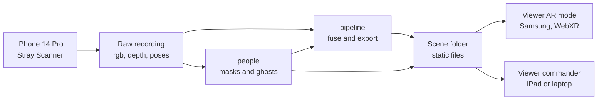

# OmniSight: Master Design Doc and Build Plan

2026-09-19 · @Someone

## Start here

OmniSight lets a team outside a room see what the first person inside has seen, in place, through the wall. An iPhone 14 Pro records a walkthrough with LiDAR depth. Our Python pipeline turns it into a timestamped 3D map. A web viewer shows that map in AR on a Samsung phone and as a commander view on the iPad.

We ship record-and-replay, not live streaming. The deliverable is a demo video plus a table demo. Everything on screen must be real output of our code.

Do these three things in your first hour:

1. Read "Locked scope", "The data contract" and your row in "Lanes".
2. Run your lane's installs from "Setup instructions" while the Wi-Fi is good.
3. Join the 45-minute Phase 0 kickoff described in "Phase plan".

Replace Dev A, B and C below with your names.

| Person | Lane | First deliverable | Due |
| --- | --- | --- | --- |
| Dev A | Pipeline (Python), owns the iPhone and recordings | Two far-apart frames stacked into one coherent `.ply` | Hour 3 |
| Dev B | Viewer (three.js, WebXR), owns the Samsung | Fake room visible in AR on the Samsung | Hour 3 |
| Dev C | People detection, glue, then producer | `omni_format.py` and the fake scene generator | Hour 1 |

## Locked scope

Three features are the whole pitch, and they never get cut:

1. **Through-wall alignment.** The recorded room lines up with the real wall to within about 10 cm.
2. **Person ghosts.** A person inside shows as a highlighted 3D figure, visible through the wall.
3. **Staleness.** Every surface and every person carries an age. Old data fades and is labelled "last seen N s ago".

What we are building:

- A Python pipeline that reads one Stray Scanner recording and writes a scene folder of static files.
- A web viewer with two modes: AR on the Samsung, and a commander view for the iPad and laptops.
- A time-ordered replay, so the map fills in as the responder walks.

What we are not building:

- Live streaming. The file format doubles as the future wire format, and that is our roadmap slide.
- Native apps, goggles, or custom hardware.
- Any threat or identity labelling. A detected human is labelled "person" and nothing else.
- Any language model in the core build. This keeps the No Wrapper track open until feature freeze.

Framing: we lead with fire and search-and-rescue. Defense and tactical use appear only on the market slide.

## Tracks and submission strategy

We build one LLM-free core, then choose one of two submission paths at feature freeze (hour 16). No Wrapper bans language models in the finished project, so Nemotron and No Wrapper cannot both be entered.

| Path | Tracks entered | Choose it when |
| --- | --- | --- |
| Pure (default) | No Wrapper, Seed Round, non-LLM bonus tracks | The core is our strongest story, or nobody has 3 to 4 spare hours after hour 13 |
| Nemotron | Beyond the Chatbot, Seed Round, bonus tracks | Core features are solid on camera by hour 13 and the hazard layer produces a real accuracy number |

Why it is a close call: Beyond the Chatbot has three equal winning teams, each getting four Jetson Orin Nano Supers. No Wrapper pays AirPods 4, a keyboard, or a bottle, but likely has the thinnest field.

What each main track asks for, in the organizers' words:

- **No Wrapper:** something hard in a way we can explain, and a working demo judges can try. Classical machine learning is fine.
- **Seed Round:** a real problem, a working product and not a pitch deck, and a reason to believe people want it.
- **Beyond the Chatbot:** Nemotron doing something other than chat, with a clear role and evidence it works.

Bonus tracks, in priority order. Pick at most two, because each one competes with polish on the core.

| Bonus track | Works on Pure path | What we would do | Effort |
| --- | --- | --- | --- |
| MLH Presage | Yes | Pin breathing and pulse to the found person's ghost | 2 to 3 h |
| ElevenLabs (Out Loud and MLH) | Needs organizer ruling on text-to-speech | Templated radio callouts, no LLM | 1 to 2 h |
| MLH DigitalOcean and .Tech | Yes | Host the viewer there, register a domain | 30 min |
| MLH Tiger Data | Yes | Mission log of poses and sightings with last-seen queries | 2 h |
| MLH Gemini, Snowflake | No, both are LLM APIs | Skip |  |
| MLH Solana | No fit | Skip |  |

If the team is mostly first-time hackers, check the Cold Start eligibility rule as well.

## System architecture

The MVP has no server. The pipeline writes a folder of static files, and the viewer fetches them and plays them on a clock.



Read it left to right: one recording feeds two Python stages, both write into one scene folder, and both viewer modes read the same files.

Static hosting matters for two reasons. WebXR only runs over HTTPS, which GitHub Pages provides. Judges can also open the commander view on their own phones from a QR code.

| Device | Role | Software |
| --- | --- | --- |
| iPhone 14 Pro | Inside camera, the "responder" | Stray Scanner app (free) |
| Samsung phone | Outside AR viewer | Chrome with WebXR, which runs on ARCore |
| iPad Air M3 | Commander view | Safari, normal WebGL (no WebXR AR on iOS) |
| Laptops | Pipeline, dev servers, video editing | Python 3.10+, Node 20+ |

Repo layout:

```
OmniSight/
  docs/CONTRACT.md          copy of "The data contract" section, frozen in hour 1
  common/omni_format.py     chunk writer/reader + round-trip test      (C)
  tools/make_fake_scene.py  fake room in the real format               (C)
  pipeline/                 load -> normalize -> fuse -> export        (A)
  people/                   person masks + ghost points                (C)
  viewer/                   Vite + three.js, AR + commander modes      (B)
  viewer/public/scenes/     processed scenes, small, committed
  data/raw/                 recordings, gitignored, shared by Drive
```

## The data contract

This section is frozen at the end of Phase 0. Nobody changes it without telling the other two, because it is what lets three people build in parallel.

### World frame

Right-handed, Y up, meters. The origin is the camera position at the first recorded frame. The -Z axis is that frame's forward direction flattened to horizontal. This matches WebXR's `local` reference space and three.js, so the viewer does no conversions.

### Scene folder

One folder per processed recording, at `viewer/public/scenes/<scene_name>/`.

| File | Written by | Contents |
| --- | --- | --- |
| `manifest.json` | A | Duration, chunk list, `floor_y`, `wall_z`, sources, processing time in seconds |
| `chunks/0000.bin` ... | A | Static splats first seen in each 0.5 s window |
| `alignment.bin` | A | Splats on the viewer's side of the wall, shown only while aligning |
| `trajectory.json` | A | Responder camera pose over time |
| `people.json` | C | Index of ghost frames: time, byte offset, count, centroid |
| `people.bin` | C | Ghost points for every frame that contains a person |
| `labels.json` | optional | Hazard pins, only on the Nemotron path |

### Chunk binary layout

Little-endian. `alignment.bin` uses the same layout. A chunk file is byte-identical to a future WebSocket message, so going live later is a transport swap.

```
char[4]  "OMNI"
uint32   version = 1
uint32   N                     number of splats
float32  t_start
float32  t_end
uint32   reserved              header is 24 bytes
float32  positions[3N]         world frame, meters
float32  normals[3N]           unit length, world frame
float32  radius[N]             meters
float32  t_seen[N]             seconds from recording start
uint8    rgbs[4N]              r, g, b, source_id
```

Every array starts on a 4-byte boundary, so JavaScript can wrap each one in a typed array without copying.

### people.bin layout

Per-frame blocks are concatenated. Each block is `float32 positions[3n]` followed by `uint8 rgba[4n]`, so every block is 16n bytes and offsets stay 4-byte aligned.

### JSON shapes

```json
// manifest.json
{
  "version": 1,
  "scene": "room_a_take3",
  "duration": 58.2,
  "chunks": [{"file": "chunks/0000.bin", "t_start": 0.0, "t_end": 0.5, "count": 18234}],
  "alignment_chunk": "alignment.bin",
  "wall_z": -1.8,
  "floor_y": -1.32,
  "sources": [{"id": 0, "label": "Responder 1", "device": "iPhone 14 Pro, Stray Scanner"}],
  "processing_seconds": 41.3
}

// trajectory.json: one entry per processed frame
[{"t": 0.0, "source": 0, "position": [0, 0, 0], "quaternion": [0, 0, 0, 1]}]

// people.json: one entry per frame that contains a person
[{"t": 12.4, "frame": 372, "offset": 0, "count": 2210, "centroid": [1.2, -0.4, -3.1]}]
```

Quaternions are `[x, y, z, w]`, the order three.js uses. `offset` is in bytes.

## Lanes

Each person owns one directory and one device, so nobody blocks anybody and merge conflicts stay rare.

| Lane | Owns in the repo | Owns physically | Stack | Hands off to |
| --- | --- | --- | --- | --- |
| Dev A, Pipeline | `pipeline/` | iPhone 14 Pro, all recordings | Python, numpy, OpenCV, Open3D | Scene folders to B; extracted frames to C |
| Dev B, Viewer | `viewer/` | Samsung phone, iPad | JavaScript, three.js, WebXR, Vite | Frame rate and point budget back to A |
| Dev C, People and Producer | `common/`, `tools/`, `people/`, `docs/` | Video, Devpost, table demo | Python, a pretrained segmentation model | Person masks to A; ghost files to B |

Dev C stops writing features around hour 13 and becomes the producer: storyboard, shooting, editing, README and submission. A and B stay on bug duty from then on.

Git rules:

- Work on short-lived branches and merge to `main` often. Stay inside your own directory unless you have told the owner.
- Commit early and often. The history is our proof that the work happened this weekend.
- Never commit raw recordings. `data/raw/` is gitignored, and recordings go in a shared Drive folder.
- Do commit processed scenes under `viewer/public/scenes/`. They are small, and the deployed site needs them.
- Any change to "The data contract" is announced to both teammates before it is merged.

## Setup instructions

Run the heavy installs first, while the Wi-Fi is good. PyTorch alone is about 2 GB.

### Everyone

- [ ] Clone the OmniSight repo and confirm you can push a branch.
- [ ] Install Python 3.10 or newer and Node 20 or newer.
- [ ] Join the shared Drive folder for raw recordings.
- [ ] Bring chargers and a phone hotspot. Do not rely on venue Wi-Fi.

### Dev A, Pipeline

- [ ] Install [Stray Scanner](https://apps.apple.com/us/app/id1557051662) on the iPhone 14 Pro. It is free and needs a LiDAR device.
- [ ] Read `docs/format.md` in the [Stray Scanner repo](https://github.com/StrayRobots/scanner) before writing the loader.
- [ ] `pip install numpy scipy opencv-python pillow open3d`
- [ ] Record 10 seconds and get the files onto your laptop. Test the transfer path now: Finder on a Mac, the Apple Devices app on Windows, or the in-app share menu to a cloud drive.

### Dev B, Viewer

- [ ] `npm create vite@latest viewer -- --template vanilla`, then `npm i three` and `npm i -D @vitejs/plugin-basic-ssl`.
- [ ] On the Samsung, confirm "Google Play Services for AR" is installed and up to date.
- [ ] Open the official immersive-web AR sample in Chrome on the Samsung to confirm WebXR AR works.
- [ ] Enable Developer options and USB debugging on the Samsung. This gives you `adb reverse tcp:5173 tcp:5173` and remote debugging at `chrome://inspect`.
- [ ] Check that the Samsung's built-in screen recorder captures the AR view, camera feed included.
- [ ] Later, for the Spark upgrade: install the Spark renderer from npm. Confirm the package name on sparkjs.dev.

### Dev C, People and Producer

- [ ] `pip install ultralytics` and run the nano segmentation checkpoint on any photo of a person.
- [ ] Turn on GitHub Pages for the repo. Free plans need a public repo; Vercel or Netlify work otherwise.
- [ ] Install a video editor you already know (CapCut, DaVinci Resolve or iMovie).
- [ ] Only after feature freeze, and only if we choose them: NVIDIA build API key, Presage API key, ElevenLabs key.

## Phase plan

Six phases, each with an exit check. Hours count from kickoff and assume about 20 hours of build time. With less time, keep the order and cut from the bottom of the cut list.

| Phase | Ends at | Exit check |
| --- | --- | --- |
| 0 Kickoff | 0:45 | Contract frozen, room and jig chosen, devices verified |
| 1 Prove the data path | Hour 3 | Real room visible in a laptop browser; fake room visible in AR on the Samsung |
| 2 Through the wall | Hour 8 | Samsung shows the recorded interior through the real wall, within about 10 cm |
| 3 Product features | Hour 13 | Ghosts, staleness, portal, responder trail and commander view all work |
| 4 Hero capture | Hour 16 | Final recording processed; feature freeze; path decision made |
| 5 Shoot, edit, submit | Hour 20 | Video and Devpost submitted with 2 hours of buffer |

### Phase 0: kickoff, everyone, 45 minutes

- [ ] Ask organizers the questions listed under "Open questions".
- [ ] Verify the iPhone transfer path and the Samsung AR sample (see "Setup instructions").
- [ ] Read "The data contract" together, fix anything unclear, then copy it to `docs/CONTRACT.md`.
- [ ] Pick the demo room and build the jig (see "Capture protocol").
- [ ] Create a GitHub Projects board from the task lists below.

### Phase 1: prove the data path, to hour 3

- [ ] **A:** `loader.py` reads color video, depth, confidence, poses and the calibration matrix. Decode the video sequentially.
- [ ] **A:** stack frame 0 and a frame from 20 s later into one `.ply`. Walls must coincide.
- [ ] **B:** Vite app, chunk parser in JS, `THREE.Points` renderer with a small shader.
- [ ] **B:** serve over HTTPS and show the fake room in AR on the Samsung.
- [ ] **C:** `omni_format.py` with a round-trip test, and `make_fake_scene.py`, both inside the first hour.
- [ ] **C:** person masks working on A's extracted frames.

If the real point cloud is still incoherent at hour 4, stop and debug it as a team. Nothing downstream matters until it is right.

### Phase 2: through the wall, to hour 8

- [ ] **A:** `fuse.py` with filters, unprojection, normals, voxel dedupe, wall split, chunk export and `trajectory.json`.
- [ ] **A:** one CLI command turns a raw recording into a scene folder.
- [ ] **B:** load real scenes under one `sceneRoot` group with four alignment sliders saved in localStorage.
- [ ] **B:** alignment mode and x-ray mode; play, pause, restart; HUD via WebXR dom-overlay.
- [ ] **C:** `people/run.py` writes masks for A, plus `people.bin` and `people.json` for B.
- [ ] **C:** GitHub Pages deploy of the viewer and one scene.
- [ ] **Everyone:** film a rough clip of the through-wall view as insurance.

### Phase 3: product features, to hour 13

- [ ] **A:** apply C's masks so people do not smear into the static map. Estimate `floor_y`.
- [ ] **A:** tune voxel size to B's frame rate, starting from a budget of about 800k points.
- [ ] **A:** support multiple recordings with `source_id`.
- [ ] **B:** person ghosts with hold, fade and a "last seen" label.
- [ ] **B:** staleness shading, responder frustum and trail, and the portal.
- [ ] **B:** commander mode via `?mode=commander` with orbit, top-down toggle and timeline scrubber.
- [ ] **C:** storyboard, caption text, README draft, Devpost draft.
- [ ] **C:** QA pass. Try to break alignment and record the slider values per device.

### Phase 4: hero capture, to hour 16

- [ ] Record the final walkthrough three times, process all three, pick the best.
- [ ] Stretch: a second recording from the same jig as "Responder 2".
- [ ] A and B fix only what the hero footage exposes.
- [ ] Feature freeze at hour 16. Decide Pure path or Nemotron path.

### Phase 5: shoot, edit, submit, to hour 20

- [ ] Shoot every item on the shot list in "Demo video".
- [ ] Edit with captions, record the voiceover, export.
- [ ] Finish README and Devpost, select tracks, submit with 2 hours to spare.
- [ ] Prepare the table demo kit.

## Capture protocol

Every recording and every AR session starts from the same physical spot, the jig. That shared start is what puts the iPhone and the Samsung in one coordinate frame.

### Choosing the room

- Under 5 m deep, because phone LiDAR loses confidence beyond that.
- Matte walls, good even lighting, and some clutter so tracking has features to hold.
- No mirrors, large windows, glass walls or big TVs. LiDAR fails on them.
- A wall we can stand about 2 m back from on the outside, plus a door on another side.
- Available at 3am, and nobody minds us taping the floor.

### Building the jig

1. Put a chair or box about 2 m back from the wall we will look through, facing it squarely.
2. Tape an outline on top for the phone, at roughly chest height.
3. Tape around the chair feet so the chair can be put back exactly.
4. Photograph the setup so anyone can rebuild it.

The jig sits 2 m back because ARCore and ARKit both need to see texture to start tracking. A phone pressed against a blank wall will not initialize.

### Recording a take

1. Prop the door open before recording. A moving door smears into the map.
2. Place the iPhone in the jig outline, landscape, camera facing the wall.
3. Start recording in Stray Scanner. Hold still for 2 seconds.
4. Pick the phone up and walk to the door slowly. Keep it at chest height.
5. Walk the room in one linear pass, under 60 seconds in total. Avoid fast turns and avoid backtracking.
6. Point the camera at the "person" teammate for at least 5 seconds, then look away so the last-seen fade has something to show.
7. Stop recording. Check that the video plays upright. If it is upside down, flip the phone 180 degrees next time.

### After each take

- Name the folder `data/raw/<date>_<room>_take<N>/` and upload it to the shared Drive.
- Process it straight away. A bad take is cheap to redo now and expensive to discover at hour 17.
- For AR viewing, close the door. The x-ray effect is weaker if people can see in anyway.

## Pipeline design notes (Dev A)

The pipeline is four steps: load, normalize, fuse, export. One command turns a raw recording into a scene folder.

```
python -m pipeline.run data/raw/<take> --out viewer/public/scenes/<scene> \
    --voxel 0.025 --wall-z -1.8 --stride 3 --masks people_out/<take>/masks
```

### 1. Load

The details below are from memory of the app's format doc. Confirm each against `docs/format.md` before relying on it.

- `rgb.mp4`: color video, expected 1920 x 1440.
- `depth/000000.png` ...: 16-bit PNGs in millimeters, expected 256 x 192.
- `confidence/000000.png` ...: 0 low, 1 medium, 2 high.
- `odometry.csv`: timestamp, frame, x, y, z, qx, qy, qz, qw. One camera-to-world pose per frame.
- `camera_matrix.csv`: 3 x 3 intrinsics for the color resolution.

Scale the intrinsics to depth resolution: multiply fx, fy, cx and cy by depth width over color width. Assert that frame, depth and pose counts match.

### 2. Normalize poses

The AR session may start before record is pressed, so frame 0 may not sit at the origin.

1. Take frame 0's position as the new origin.
2. Take frame 0's forward vector, project it onto the horizontal plane, and rotate about Y so it points along -Z.
3. Apply that one yaw-plus-translation transform to every pose. Never tilt the frame, so gravity stays along Y.

Check whether the exported camera convention is OpenCV (z forward, y down) or ARKit (z backward, y up). The two-frame `.ply` test tells you: a wrong convention gives an exploded cloud.

### 3. Fuse

For every `stride`-th frame:

```
keep pixel if  confidence == 2
          and  0.3 m < d < 4.5 m
          and  |d - d_neighbor| < 0.05 * d        (drops flying pixels at edges)
          and  pixel not in dilated person mask

p_cam   = [(u - cx) * d / fx, (v - cy) * d / fy, d]     (OpenCV convention)
p_world = T_world_cam @ [p_cam, 1]
normal  = cross product of neighboring unprojected points, flipped toward the camera
radius  = max(d / fx, voxel / 2)
color   = color frame resized to depth resolution
```

Voxel dedupe: quantize `p_world` to the voxel grid and pack the three indices into one int64 key. Keep a sorted array of seen keys. A point is new only if its key is unseen. First observation wins and sets `t_seen`.

Known limitation: re-observed surfaces do not refresh their age. Keep the hero walkthrough linear so this never shows.

### 4. Export

- Split on `wall_z`: points with z greater than `wall_z` are on the viewer's side and go to `alignment.bin`. The rest go to chunks.
- Bucket chunk points by `t_seen` into 0.5 s windows. Write with `common/omni_format.py`.
- `floor_y` is the 5th percentile of all point heights.
- Write `trajectory.json` from the normalized poses, and record wall-clock processing time in the manifest.

### Sanity checks before handing a scene to B

- [ ] Walls are flat and meet at right angles in a point cloud viewer.
- [ ] The first trajectory pose is the identity.
- [ ] Total points are within B's budget.
- [ ] No person-shaped smear where the teammate stood.

## Viewer design notes (Dev B)

One codebase, two modes, picked by URL: `?mode=ar` on the Samsung and `?mode=commander` everywhere else. Add `&scene=<name>` to choose the scene folder.

### Renderer

Start with `THREE.Points` and a custom shader. It is 30 minutes of work and carries no risk.

- Attributes: position, color, `aRadius`, `aTime`.
- Uniforms: `uClock` for the replay time, plus the staleness constants.
- Vertex shader: hide the point when `aTime > uClock`. Point size comes from `aRadius` and distance.
- Fragment shader: round points, color faded by age (see Staleness).

Because reveal and fade both happen in the shader, the viewer can load every chunk up front and simply advance `uClock`.

### WebXR setup

```js
const renderer = new THREE.WebGLRenderer({ alpha: true, antialias: true });
renderer.xr.enabled = true;
renderer.xr.setReferenceSpaceType('local');   // three.js defaults to 'local-floor'
scene.background = null;                      // camera feed shows through
document.body.appendChild(ARButton.createButton(renderer, {
  optionalFeatures: ['dom-overlay'],
  domOverlay: { root: document.getElementById('hud') }
}));
```

The `local` space puts the origin where the phone was when the session started. Starting the session in the jig makes that origin match the recording's origin.

### Alignment

- Put all scene content under one `sceneRoot` group.
- Four sliders drive it: x, y, z in 1 cm steps and yaw in 0.5 degree steps. Save them in localStorage per device.
- **Alignment mode** shows `alignment.bin`, the recorded outside of the wall. Nudge the sliders until it sits on the real wall and door frame.
- **X-ray mode** hides `alignment.bin`, so the wall no longer blocks the view.
- Every new AR session must start from the jig. The slider values only correct the constant offset between the two phones.

### Portal

An invisible plane at `wall_z` with a circular hole, about 0.6 m in radius, that follows the gaze.

- Build it with `THREE.Shape` plus a hole path. Material: `colorWrite: false`, `depthWrite: true`, rendered before the points.
- Each frame, intersect the camera's forward ray with the wall plane and center the hole there.
- Add a thin glowing ring at the hole's edge.

The room is then visible only through the hole, which reads as a window in the wall and hides alignment error at the edges.

### Ghosts

- For the current clock, draw the latest ghost frame from `people.bin` in a highlight color.
- Set `depthTest: false` on ghosts so people show through the whole wall, not only through the portal.
- When no ghost frame exists for the current time, hold the last one, fade it over about 15 s, and show "person, last seen N s ago" at its centroid.

### Staleness

Age is `uClock - aTime`. Full color for the first 5 s, then blend toward a desaturated blue-gray until 30 s, and hold there. Add a small legend to the HUD.

### Responder and commander view

- Draw the responder as a camera frustum at the current `trajectory.json` pose, with a trail of past positions.
- Commander mode uses OrbitControls, a top-down toggle, a timeline scrubber and no portal.

### Targets and the Spark upgrade

- Hold 30 fps or better on the Samsung. Report the point count that achieves it to A.
- Stretch: a Spark renderer behind `?renderer=spark`, with each splat a flat disk oriented by its normal and sized by its radius. Check Spark's docs for the procedural splat API and its WebXR example first. Keep Points as the fallback.

## People pipeline notes (Dev C)

`people/run.py` does two jobs per frame: it tells A which pixels to ignore, and it gives B a 3D figure to draw.

```
python -m people.run data/raw/<take> --out people_out/<take> --stride 2
```

### First hour: format library and fake scene

- `common/omni_format.py`: `write_chunk`, `read_chunk`, `write_people`, plus a round-trip test.
- `tools/make_fake_scene.py`: a 4 x 3 x 2.5 m box room revealed over 20 s, a capsule "person" walking across it, and a straight-line trajectory. Write it to `viewer/public/scenes/fake/` in the real format.

This unblocks B before any real data exists.

### Masks for A

1. Run a small pretrained segmentation model on each color frame and keep the "person" class.
2. If the video is rotated, rotate the frame upright before detection and rotate the mask back.
3. Resize the mask to depth resolution with nearest-neighbor and save it as `masks/000123.png`.

A dilates these masks by a few pixels before excluding them, which catches fuzzy edges.

### Ghost points for B

1. Erode the mask by one pixel, which removes flying pixels at the silhouette.
2. Keep masked depth pixels with confidence 1 or 2.
3. Unproject them with A's function, using A's normalized poses. Import it; do not reimplement it.
4. Append positions and colors to `people.bin`, and add an index entry to `people.json` with `t`, `offset`, `count` and the centroid.

Subsample to keep `people.bin` under about 15 MB for a 60 s take.

### Rules

- The label is always "person". No identity, no threat level, no guesses about who it is.
- The hold-and-fade logic lives in the viewer. This stage only reports what was actually seen and when.

### If organizers rule out a pretrained segmentation network

Switch to a geometric detector. A voxel seen as occupied in only a short run of frames is a moving object. Flag those points as the ghost and drop them from the static map. It is harder to build, but it is a stronger answer to "what was hard here".

## Gotchas that will actually bite

These are the failure modes most likely to cost us hours. Check the list whenever something looks wrong.

| Symptom | Likely cause | Fix |
| --- | --- | --- |
| Point cloud looks warped or stretched | Intrinsics used at color resolution on depth pixels | Scale fx, fy, cx, cy by depth width over color width |
| Cloud "explodes" when frames are stacked | Wrong camera convention or inverted pose | Test OpenCV vs ARKit axes; test pose vs its inverse; use the two-frame `.ply` check |
| Whole scene is offset or rotated in the viewer | Frame 0 is not at the origin | Normalize all poses to frame 0, yaw only |
| Scene floats too high or low in AR | three.js default `local-floor` space | Call `setReferenceSpaceType('local')` |
| "Enter AR" button missing or fails | Page not served over HTTPS | Vite basic-ssl plugin over the hotspot, or `adb reverse` and use localhost |
| AR tracking never starts | Camera sees a blank surface at session start | Start from the jig, 2 m back, facing a textured view |
| Holes or noise in the map | Glass, mirrors, glossy black, or range over 5 m | Choose a better room; keep confidence 2 only |
| Ragged halos around objects | Flying pixels at depth edges | Drop pixels whose depth jumps more than 5% from a neighbor |
| Person-shaped smear in the room | People fused into the static map | Apply dilated person masks in the fuse step |
| Cannot see through the wall | Recorded outside of the wall is being drawn | X-ray mode must hide `alignment.bin` |
| Alignment drifts as the walk goes on | Tracking drift grows with distance | Keep the walk short, slow and linear |
| Frames and poses out of step | Seeking inside the mp4 | Decode the video sequentially and count frames |
| Phone dims, throttles or dies | Continuous LiDAR or AR heats the device | Keep chargers nearby and rest the phone between takes |
| Repo balloons or pushes fail | Raw recordings committed | `data/raw/` stays gitignored |

One honesty rule sits with these. If the Points renderer is what appears on screen, we call it point-based rendering. We say Gaussian splatting only if the Spark path ships.

## Cut list and stretch goals

When we fall behind, cut in this order: Spark renderer, second responder, timeline scrubber, portal (fall back to plain x-ray mode), commander polish. Never cut alignment, ghosts or staleness.

No stretch goal starts before the Phase 3 exit check passes.

| Stretch goal | Path | Owner | Effort | What it adds |
| --- | --- | --- | --- | --- |
| Spark renderer | Both | B | 2 to 3 h | True oriented Gaussians, a more solid-looking surface |
| Second responder | Both | A | 1 to 2 h | The multi-camera story. A second take from the same jig lands in the same frame |
| Presage vitals | Both | C | 2 to 3 h | Breathing and pulse pinned to the found person's ghost |
| Voice callouts | Both, pending ruling | C | 1 to 2 h | Templated radio lines spoken by ElevenLabs text-to-speech |
| DigitalOcean and .Tech | Both | C | 30 min | Hosting and a domain, for two MLH tracks |
| Tiger Data mission log | Both | A or C | 2 h | Last-seen queries and after-action replay from SQL |
| Nemotron hazard layer | Nemotron only | C with A | 3 to 4 h | Verified hazard and exit pins, seen through the wall |

### Nemotron hazard layer, if we take that path

This is one extra offline stage that writes `labels.json`. The viewer draws pins when the file exists.

1. Run an open-vocabulary detector on keyframes for a fixed list: gas cylinder, fire extinguisher, door, stairs, window.
2. Lift each hit into 3D with the same depth lookup used for person centroids.
3. Cluster hits across frames, merging same-label hits within 0.5 m.
4. Send each cluster's best crop to [Nemotron 3 Nano Omni](https://build.nvidia.com/nvidia/nemotron-3-nano-omni-30b-a3b-reasoning/modelcard), which accepts image input. Ask for strict JSON: confirmed or not, hazard level, one-line note.
5. Show confirmed pins with "seen N s ago".

Evidence for the judges: hand-label about 40 clusters, then report pin precision with and without Nemotron verification. There is no chat box anywhere in the product.

### Presage vitals, if we add it

The responder holds a camera on the found person, and the reading is pinned to that person's ghost with its age.

- The [Presage docs](https://docs.physiology.presagetech.com/) say breathing rate needs a full 30-second window, a stationary subject, and a well-lit face and chest.
- The SDK covers Android, iOS, C++ and Node.js, with a free API key ([get started](https://smartspectra.presagetech.com/docs/)).
- The iPhone is busy recording, so run Presage on a Samsung or a laptop.
- The metrics are wellness-only and not FDA cleared. Caption them that way on screen.

## Demo video and table demo

The video runs 60 to 90 seconds and opens on the hero shot. Dev C owns it, and confirms the length limit with the organizers first.

| # | Shot | Length | How to capture |
| --- | --- | --- | --- |
| 1 | Cold open: a phone held up to a closed wall, a glowing figure moving behind it | 5 s | Third-person camera, plus the Samsung screen recording |
| 2 | The problem in one sentence, with fire and rescue framing | 10 s | Voiceover over b-roll of the closed door |
| 3 | Responder walks in; split screen with the commander view filling in | 20 s | Third-person camera, plus a screen recording of the commander view |
| 4 | AR x-ray: portal, ghost, the "last seen" fade | 15 s | Samsung screen recording |
| 5 | Proof: walk around the wall into the room; the virtual room matches the real one | 10 s | Samsung screen recording, one continuous take |
| 6 | How it works, in three boxes, with no language model anywhere | 15 s | Simple animated diagram |
| 7 | Roadmap: live transport, thermal sensor, multiple responders | 10 s | Title cards |

Shot 5 is the most important one. It is what convinces a skeptical judge that nothing is faked.

### Honesty captions

- During any replay: "Replayed from a recorded walkthrough. Processed in N seconds." N comes from the manifest.
- On sped-up footage: the speed factor, for example "4x".
- On any mockup, such as a goggles view: "Concept mockup".
- With a second responder: "Two recorded walkthroughs replayed together".
- With Presage vitals: "Wellness estimate, not a medical device".

### Table demo kit

No Wrapper asks for a demo judges can try, and Seed Round asks for a working product. Do not rely on the video alone.

- [ ] A QR code on the table that opens the commander view on the judge's own phone.
- [ ] The iPad running the commander view, for people to orbit and scrub.
- [ ] The video looping on a laptop with captions on, because the hall will be loud.
- [ ] If any wall or partition is near the table: scan behind it on site and hand judges the Samsung. The pipeline is one command, so this takes about two minutes.
- [ ] A one-page printout: the architecture diagram, the three features, and what was hard.

## Pitch notes

One-liner: OmniSight fuses whatever camera goes in first into one shared 3D map, shows it in place through the wall, and tells you how old every part of it is.

### Use cases, strongest first

1. **Fire and rescue.** Finding a downed firefighter, tracking which rooms are searched, briefing crews that arrive late.
2. **Robot or drone goes in first.** Tactical, hazmat and collapse response, where nobody wears anything.
3. **Training and after-action review.** Replay a search drill in 3D. This is what we have built, and it needs no smoke-proof hardware.
4. **Industrial confined spaces.** Tanks, mines, boilers and sewers.
5. **Construction.** Scan walls before they are closed, then see pipes and wiring later.
6. **Defense.** Large budgets, but the hardest market to enter.

### Who else is here, and how we differ

| Who | What they do | Our difference |
| --- | --- | --- |
| [Qwake C-THRU](https://www.usfa.fema.gov/blog/c-thru-new-system-for-situational-awareness-in-low-visibility/) | Helmet thermal AR plus a commander tablet that shows each crew member's view. [DHS funded 400 test units with $4.7M](https://www.firehouse.com/technology/press-release/55093731/dhs-opens-testing-for-c-thru-navigation-device-for-firefighters) | They stream individual views. We fuse one shared map with memory |
| [BRINC Lemur 2](https://brincdrones.com/lemur-2-faqs/) | Indoor drone that builds a 3D model in flight and shows a 2D floor plan on its controller. [Raised $125M in July 2026, led by Motorola Solutions](https://dronedj.com/2026/07/14/brinc-funding-motorola-emergency-drones/) | In-place view for the whole team, several sources fused, data age shown |
| [Anduril EagleEye](https://www.army-technology.com/news/anduril-ai-eagleeye-helmets/) | Military headset family with teammate tracking | Military only. We show what a teammate has seen, not only where they are |
| [Flyability Elios 3](https://www.mining-technology.com/featured-company/2025-flyability-elios-3-mapping-innovation-infra-safety/) | Caged LiDAR drone mapping confined industrial spaces | Proof that customers pay for "see inside without entering" |

### Market facts we can cite

- About 29,452 US fire departments and roughly 1.04 million firefighters, per NFPA's profile of 2020 ([summary](https://internationalfireandsafetyjournal.com/number-of-firefighters-in-us-drops-4/)).
- 82% of departments are all or mostly volunteer. The career and mostly-career 18% protect over two-thirds of the population.
- That is 2,785 all-career plus 2,459 mostly-career departments, so about 5,200 realistic buyers ([breakdown](https://portal.ct.gov/cfpc/frequently-asked-questions)).
- The Army awarded about $354M in headset prototype contracts in September 2025: $159M to Anduril and $195M to Rivet ([DefenseScoop](https://defensescoop.com/2025/09/08/army-sbmc-contract-awards-anduril-rivet-soldier-borne-mission-command/)).
- The Army put about $1.8B into the earlier IVAS headset and found it unfit for the field, with cybersickness among the problems ([summary](https://samsearch.co/government-contracting-news/us-army-transitions-to-new-ar-combat-goggle-procurement-strategy-138865)). Our lesson: commander tablet first, headset later.

### Go-to-market story for Seed Round

Start with training and after-action review for fire academies and career departments. It needs no life-safety certification, and it works with today's build. Expand to drone and robot integrations for live operations, then to worn thermal sensors.

### Honest limits to state before judges ask

- Smoke defeats color cameras and phone LiDAR. The real sensor is thermal, and our pipeline only needs posed depth.
- The taped jig must become automatic alignment. Drift and multi-floor buildings are open problems.
- We capture the insides of private spaces, so retention and access rules matter.
- We have no users yet. One conversation with a firefighter or academy instructor this weekend fixes that. Ask how they track searched rooms, and how they review a drill.

### Judges, by audience

We know affiliations only, not who covers which track. Prepare a 30-second version of the pitch for each group.

| Audience | Judges from | Lead with | Have ready |
| --- | --- | --- | --- |
| Real-time 3D and systems | Roblox, Meta, NVIDIA, AWS, Microsoft, faculty | The shared coordinate frame and training-free fusion | Frame rate, point count, alignment error in cm, drift over the walk |
| Rescue and health | UPMC | Finding a person and knowing how old the sighting is | The last-seen fade; Presage vitals if built |
| Product and investors | Whim, founder-professor; Pear VC and Afore sponsor Seed Round but list no judge yet | The training wedge and the comparison table above | The firefighter quote, the buyer count |

### Prior art we name

Anduril EagleEye as the inspiration, Qwake and BRINC as the closest products, and Stray Scanner as our capture tool. Naming them up front reads as confidence.

## Open questions and decisions log

Five questions for the organizers, all asked during Phase 0. Write each answer next to its question.

- [ ] What is the exact submission deadline, and is there a video length limit?
- [ ] Is judging video-only, or is there also a table expo?
- [ ] Does a pretrained vision segmentation model count as allowed in No Wrapper?
- [ ] Does plain text-to-speech with no language model count as allowed in No Wrapper?
- [ ] Can one project enter Seed Round together with No Wrapper, plus MLH bonus tracks?

Questions for us:

- [ ] Who is Dev A, Dev B and Dev C?
- [ ] Which room is the demo room, and when can we use it?
- [ ] Which Samsung model is the viewer, and does it pass the AR sample test?
- [ ] Can the iPhone 14 Pro's owner lend it for the whole build, not only the shoot?

Decisions so far:

| Decision | Why |
| --- | --- |
| Record and replay, not live streaming | Removes network, latency and sync risk. A video deliverable allows it |
| iPhone 14 Pro with Stray Scanner as the inside camera | Real LiDAR depth and per-frame poses, with no app to write and no Mac needed |
| Samsung in Chrome WebXR as the AR viewer | No native app. It only needs pose tracking |
| Static scene files, no server | HTTPS from static hosting; judges can open it on their own phones |
| `THREE.Points` first, Spark as a stretch goal | The end-to-end path matters more than splat quality |
| Shared start jig plus four sliders for alignment | Image-marker tracking is not available in WebXR on Chrome |
| LLM-free core, path chosen at hour 16 | Keeps both No Wrapper and Beyond the Chatbot open |
| Lead with fire and rescue | It suits the judges, and it avoids surveillance questions |
